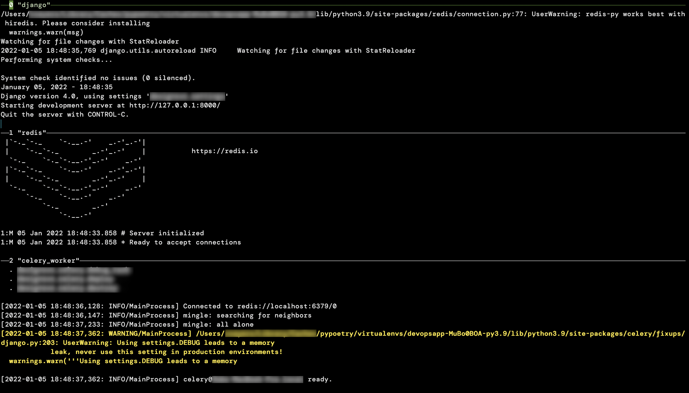

Multirun
========

Multirun is a development tool to run and monitor services needed in the development process.

Quickstart
----------

Once installed `multirun` will be in your PATH. You will also need to build a toml file with the commands
you wish to run:

```
[redis]
cmd = "make run_redis"

[celery_worker]
cmd = "make run_worker"

[django]
cmd = "make run_app"
```

then run `multirun -c path/to/multirun.toml`  

You should see a screen similar to:



Once running, you can click on individual panes to select them `C-b r` will kill and rerun the process, `C-b k` will kill all commands and exit multirun.